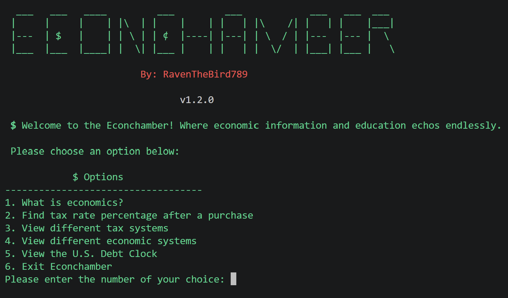

# Econchamber
Combination of python files that make up an informative app that educates users about various aspects of economics and utilizes a U.S. Debt API to show the user updates on information relevant to economics in real time

Prior to installation, ensure you have the lastest version of python installed in your terminal

To download, simply type "git clone https://github.com/RavenTheBird789/Econchamber" in your terminal's command line

Once downloaded, switch into the Econchamber directory with the command "cd Econchamber" and activate your python env with one of the following commands:

# Linux/macOS
source venv/bin/activate

# Windows (Command Prompt)
venv\Scripts\activate.bat

# Windows (PowerShell)
venv\Scripts\Activate.ps1

(Note: If you don't have an existing python env, one can easily be created with the command "python -m venv venv")

Once your env has been activated, execute the command "pip install -r requirements.txt"

To run the program, simply type "python3 econchamber.py" in your terminal's command line
